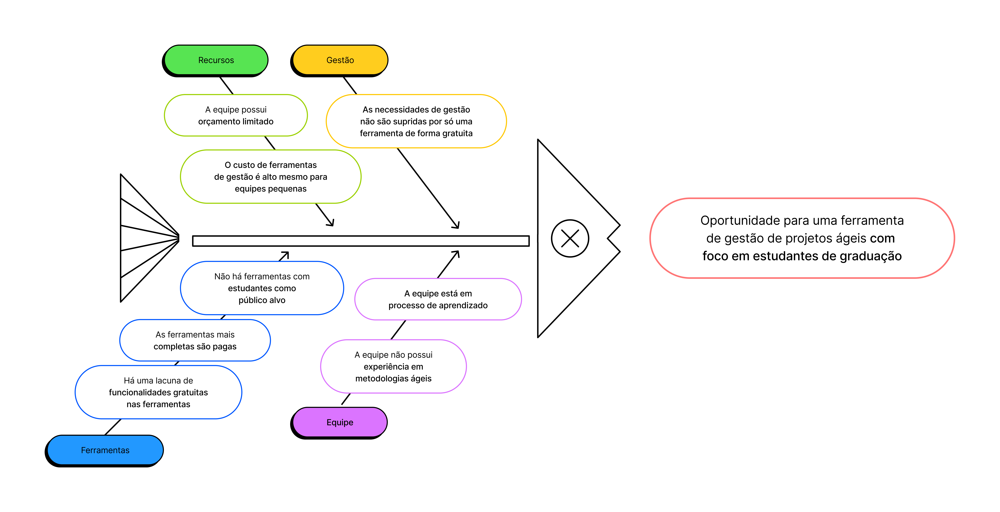

# 1.Visão Geral do Produto
Durante a formação acadêmica em cursos de engenharia, particularmente na FGA, os estudantes são colocados em uma trilha de aprendizado intensiva com atividades e disciplinas que requerem a execução de projetos práticos. Nestes cenários, as metodologias ágeis surgem como uma opção viável para o gerenciamento desses projetos. No entanto, equipes ágeis compostas por estudantes enfrentam desafios distintos que vão além das complexidades técnicas. Muitas dessas equipes operam com um orçamento bastante limitado, o que torna difícil adquirir licenças para ferramentas de gestão de projetos robustas, como IBM Jazz, Trello ou Github Projects.

Além disso, a necessidade de utilizar várias ferramentas diferentes — muitas vezes versões gratuitas com funcionalidades limitadas — pode resultar em um ambiente de trabalho fragmentado. Isso pode acarretar em duplicação de esforços e dificuldade de manter todos os membros da equipe alinhados e informados sobre o status do projeto.

Esse cenário é agravado pelo fato de que essas equipes estão em um processo de aprendizado, implicando em maior dificuldade ao usar ferramentas cujo público alvo são equipes profissionais.

Dentro do contexto apresentado, foram analisadas as versões gratuitas das ferramentas de gestão de projetos mais utilizadas por equipes ágeis com base em um conjunto de funcionalidades julgadas pela equipe como importantes para o bom andamento de um projeto ágil. Os resultados são descritos na tabela a seguir:

| Ferramenta        | Overview/Docs | Estrutura de Requisitos | Backlog do Produto | Rastreabilidade | Métricas | Quadro Kanban | Gerência de Sprints | Cargos e Permissões | Assistência Guiada | Integração de Artefatos no Git | Calendário/Timeline | Orientado a Times Ágeis |
|-------------------|--------------|-------------------------|--------------------|-----------------|----------|--------------|---------------------|---------------------|-------------------|-----------------------------|-------------------|------------------------|
| Jira              | ✅           | ✅                      | ✅                 | ✅              | ✅       | ✅           | ✅                  | ❌                  | ❌                | 🟧                          | ✅                | ❌                     |
| Trello            | ❌           | ❌                      | ❌                 | 🟧              | ❌       | ✅           | ❌                  | ❌                  | ❌                | ❌                          | ❌                | ❌                     |
| Github Projects   | ✅           | 🟧                      | 🟧                 | 🟧              | ❌       | ✅           | ❌                  | 🟧                  | ❌                | ✅                          | 🟧                | ❌                     |
| Asana             | ✅           | 🟧                      | ❌                 | ✅              | ❌       | ✅           | ❌                  | ❌                  | 🟧                | ❌                          | 🟧                | ❌                     |
| ClickUp           | ✅           | 🟧                      | ❌                 | ❌              | ❌       | ✅           | ✅                  | ❌                  | ❌                | ❌                          | 🟧                | 🟧                     |
| Monday            | ✅           | ❌                      | ❌                 | ❌              | ✅       | ✅           | ❌                  | ❌                  | ❌                | ❌                          | ❌                | ❌                     |
| Wrike             | ✅           | ❌                      | ✅                 | ❌              | ❌       | ✅           | ❌                  | ❌                  | ❌                | ❌                          | ❌                | ❌                     |

### 1.1 Oportunidade Identificada
Diante do contexto apresentado, foi identificada a oportunidade de preencher as lacunas existentes no que diz respeito às funcionalidades oferecidas pelas versões gratuitas dos produtos acima citados. Além disso, com o enfoque na público acadêmico, há a possibilidade de integrar um aspecto educativo ao produto.

.

### 1.2 Declaração de Posição
Para estudantes que desejam aprender metodologias ágeis que não possuem orçamento para licenciar ferramentas pagas de gestão de projeto, o FrameIT é uma plataforma financeiramente acessível para gestão de projetos ágeis. Ao contrário de soluções comerciais que possuem uma versão gratuita limitada, nosso produto disponibiliza funcionalidades essenciais de maneira mais completa, que permitem concentrar a gestão de projetos ágeis em um só lugar.

* **Qual é o produto que você se propõe a desenvolver?**
Uma aplicação de software projetada para auxiliar estudantes na gestão de projetos acadêmicos.
* **O que torna este produto diferente dos seus concorrentes?**
O diferencial do nosso produto está na assistência guiada, na adaptação de metodologias ágeis para o ambiente acadêmico, modelos predefinidos, barra de pesquisa universal, amostragem de métricas e personalização, oferecendo uma experiência única aos usuários.
* **Quem são os usuários-alvo e clientes do produto?**
Os usuários-alvo do produto são estudantes universitários que desejam gerenciar projetos acadêmicos de forma mais eficaz, especialmente aqueles que estão iniciando com metodologias ágeis. Os clientes podem incluir instituições de ensino superior que desejam fornecer uma ferramenta de organização e aprendizado aos seus alunos, bem como estudantes individuais que buscam uma solução para suas necessidades acadêmicas.
* **Por que os clientes deveriam utilizar / comprar este produto?**
Os clientes devem utilizar o "FrameIT" porque ele oferece uma solução abrangente e eficaz para o gerenciamento de projetos acadêmicos, promovendo a aprendizagem, a colaboração e o sucesso dos estudantes de forma gratuita e com assistência guiada.

| Pergunta                     | Resposta                                           |
|--------------------------|----------------------------------------------------------|
| Para ? | Estudantes iniciantes em metodologias ágeis
| Quem  ?                   | Equipes ágeis de baixo orçamento.              |
| O nome do produto ?| FrameIT                                   |
| Que   ?                   | Ofereçe as principais funcionalidades que são pagas. |
| Ao contrário   ?          | Jira, Trello, Azure Boards, IBM Jazz.                        |
| Nosso produto     ?      | É gratuito e completo.                    |

### 1.3 Objetivos

#### Objetivo Geral
O objetivo geral do "FrameIT" é oferecer uma ferramenta de organização eficaz e acessível para estudantes universitários, focada no gerenciamento de projetos acadêmicos, promoção da aprendizagem colaborativa e integração de metodologias ágeis.

#### Objetivos Específicos
* **Assistência Guiada:** Proporcionar assistência guiada e modelos predefinidos para facilitar a criação de projetos acadêmicos.
* **Integração de Metodologias Ágeis:** Integrar conceitos ágeis, como Kanban, no ambiente acadêmico.
* **Colaboração:** Facilitar a colaboração entre alunos, permitindo feedback em projetos acadêmicos.
* **Gestão de Tempo:** Oferecer um calendário acadêmico para auxiliar na gestão do tempo de estudo.
* **Personalização:** Permitir a personalização da interface por meio de temas e estilos visuais. 

### 1.4 Tecnologias Utilizadas
**Plataforma:** Aplicação Web  **Linguagens de Programação:** Python, Javascript/VueJs

### 1.5 Backlog do Produto

* **Assistência Guiada para Projetos:**
O FrameIT coloca a criação de projetos acadêmicos sob uma perspectiva totalmente nova, oferecendo assistência passo a passo e modelos informativos. Isso garante que os usuários tenham uma experiência educacional enriquecedora desde o início.
* **Barra de Pesquisa Universal:**
Uma barra de pesquisa eficaz é incorporada ao sistema para permitir que os usuários pesquisem tarefas, projetos, notas e recursos em toda a plataforma de maneira rápida e eficiente. Isso economiza tempo e facilita a localização de informações essenciais.
* **Calendário Acadêmico:**
O FrameIT integra um calendário acadêmico que exibe datas importantes, como prazos de inscrição, início e término de semestres, feriados acadêmicos e datas de provas. Isso ajuda os alunos a planejar e gerenciar seu tempo de estudo de maneira eficaz.
* **Personalização de Temas:**
O FrameIT permite que os usuários personalizem a aparência da interface de acordo com suas preferências, oferecendo opções de temas e estilos visuais, incluindo temas escuros e claros. Isso torna a experiência de uso mais agradável e adaptada às necessidades individuais.
* **Colaboração Aprimorada:**
 A funcionalidade de feedback e revisão de pares promove a colaboração entre os alunos, incentivando-os a aprender uns com os outros e a melhorar suas habilidades acadêmicas.
* **Organização Eficiente:**
Com recursos como a barra de pesquisa universal, o FrameIT ajuda os estudantes a manterem-se organizados em um ambiente acadêmico desafiador.
* **Personalização:**
A capacidade de personalizar temas e estilos visuais torna a ferramenta atraente para uma ampla gama de usuários, adaptando-se às preferências individuais.